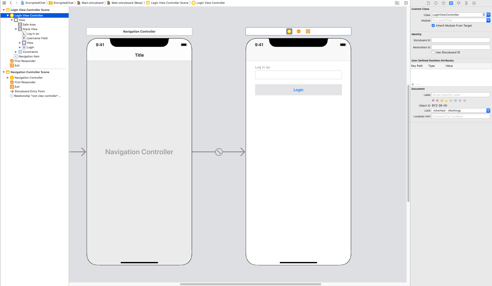
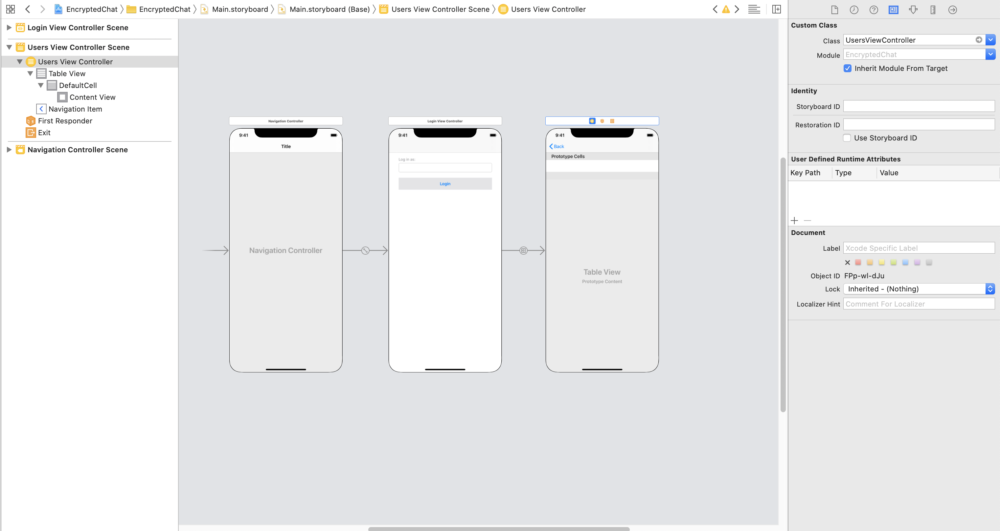
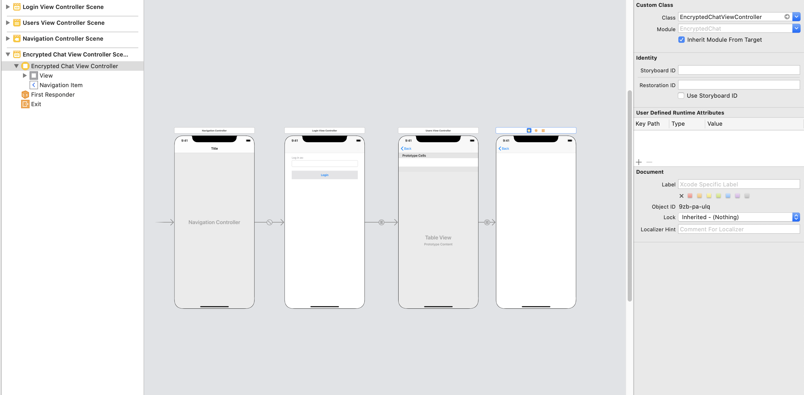
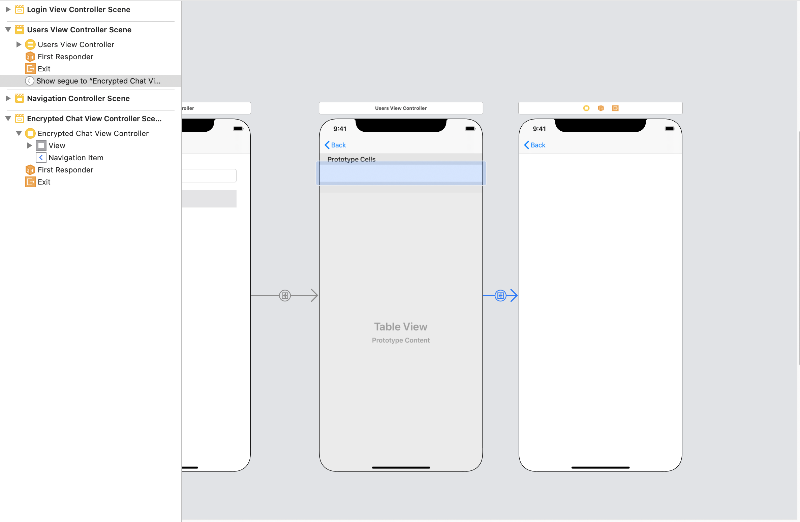
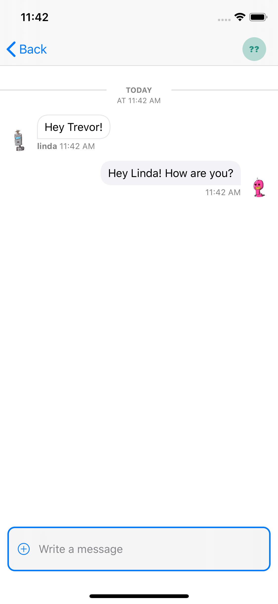

# Stream iOS (Swift) Encrypted Chat

In this tutorial, we'll build encrypted chat on iOS using Swift. We'll combine Stream Chat and Virgil Security. Both Stream Chat and Virgil make it easy to build a solution with great security with all the features you expect. These two services allow developers to integrate chat that is zero-knowledge. The application embeds Virgil Security's [eThree Kit](https://github.com/VirgilSecurity/virgil-sdk-x) with [Stream Chat's Swift](https://github.com/GetStream/stream-chat-swift) components. All source code for this application is available on [GitHub](https://github.com/psylinse/stream-ios-encrypted-chat).

## What is end-to-end encryption?

End-to-end encryption means that messages sent between two people can only be read by them. To do this, the app encrypts the message before it leaves a user's device, and only the intended recipient decrypts the message.

Virgil Security is a vendor that allows us to create end-to-end encryption via public/private key technology. Virgil provides a platform and a platform that allows us to securely create, store, and provide robust end-to-end encryption.

During this tutorial, we will create a Stream Chat app that uses Virgil's encryption to prevent anyone except the intended parties from reading messages. No one in your company, nor any cloud provider you use, can read these messages. Even if a malicious person gained access to the database containing the messages, all they would see is encrypted text, called ciphertext.

## Building an Encrypted Chat Application

To build this application we'll mostly rely on a few libraries from Stream Chat and Virgil (please check out the dependencies in the source to see what versions). Our final product will encrypt text on the device before sending a message. Decryption and verification will both happen in the receiver's device. Stream's Chat API will only see ciphertext, ensuring our user's data is never seen by anyone else, including you.

To accomplish this, the app performs the following process:

* A user authenticates with your backend.
* The iOS app requests a Stream auth token and API key from the `backend`. The Swift app creates a [Stream Chat Client](https://getstream.io/chat/docs/#init_and_users) for that user.
* The mobile app requests a Virgil auth token from the `backend` and registers with Virgil. This generates their private and public key. The app stores the private key locally, and the public key is stored in Virgil.
* Once the user decides who they want to chat with the app creates and joins a [Stream Chat Channel](https://getstream.io/chat/docs/#initialize_channel).
* The app asks Virgil's API, via the Virgil's EThree kit, for the receiver's public key.
* The user types a message and sends it to stream. Before sending, the app passes the receiver's public key to Virgil to encrypt the message. Stream Chat relays the message to the receiver. However, Stream receives ciphertext, meaning they can never see the original message.
* The receiving user decrypts the sent message using Virgil. When the message is received, the app decrypts the message using the Virgil and this is passed along to Stream's React components. Virgil verifies the message is authentic by using the sender's public key.

While this looks complicated, Stream and Virgil do most of the work for us. We'll use Stream's out of the box Swift UI components to render the chat UI and Virgil to do all of the cryptography and key management. We simply combine these services. 

The code is split between the iOS frontend contained in the `ios` folder and the Express (Node.js) backend is found in the `backend` folder. See the `README.md` in each folder to see installing and running instructions. If you'd like to follow along with running code, make sure you get both the `backend` and `ios` running before continuing.

Let's walk through and look at the important code needed for each step.

## Prerequisites

Basic knowledge of iOS (Swift) and Node.js is expected. This code is intended to run locally on your machine. 

You will need an account with [Stream](https://getstream.io/accounts/signup/) and [Virgil](https://dashboard.virgilsecurity.com/signup). Once you've created your accounts, you can place your credentials in `backend/.env` if you'd like to run the code. You can use `backend/.env.example` as a reference for the required credentials.  Please see the README in the `backend` directory for more information.

## Step 0. Setup the Backend

For our Swift app to securely interact with Stream and Virgil, the `backend` provides four endpoints:

* `POST /v1/authenticate`: This endpoint generates an auth token that allows the iOS application to communicate with the other endpoints. To keep things simple, this endpoint allows the client to be any user. The frontend tells the backend who it wants to authenticate as. In your application, this should be replaced with real authentication appropriate for your app.

* `POST /v1/stream-credentials`: This returns the data required for the iOS app to establish a session with Stream. In order return this info we need to tell Stream this user exists and ask them to create a valid auth token:
  
  ```javascript
  // backend/src/controllers/v1/stream-credentials.js
  exports.streamCredentials = async (req, res) => {
    const data = req.body;
    const apiKey = process.env.STREAM_API_KEY;
    const apiSecret = process.env.STREAM_API_SECRET;
  
    const client = new StreamChat(apiKey, apiSecret);
  
    const user = Object.assign({}, data, {
      id: `${req.user.sender}`,
      role: 'admin',
      image: `https://robohash.org/${req.user.sender}`,
    });
    const token = client.createToken(user.id);
    await client.updateUsers([user]);
    res.status(200).json({ user, token, apiKey });
  }
  ```
  
  The response payload has this shape:
  
  ```json
  {
    "apiKey": "<string>",
    "token": "<string>",
    "user": {
      "id": "<string>",
      "role": "<string>",
      "image": "<string>"
    }
  } 
  ```
  
   * `apiKey` is the stream account identifier for your Stream instance. Needed to identify what account your frontend is trying to connect with.
   * `token` JWT token to authorize the frontend with Stream.
   * `user`: This object contains the data that the frontend needs to connect and render the user's view.

* `POST /v1/virgil-credentials`: This returns the authentication token used to connect the frontend to Virgil. We use the Virgil Crypto SDK to generate a valid auth token for us:
  
  ```javascript
  // backend/src/controllers/v1/virgil-credentials.js
  async function getJwtGenerator() {
    await initCrypto();
  
    const virgilCrypto = new VirgilCrypto();
    // initialize JWT generator with your App ID and App Key ID you got in
    // Virgil Dashboard.
    return new JwtGenerator({
      appId: process.env.VIRGIL_APP_ID,
      apiKeyId: process.env.VIRGIL_KEY_ID,
      apiKey: virgilCrypto.importPrivateKey(process.env.VIRGIL_PRIVATE_KEY),
      accessTokenSigner: new VirgilAccessTokenSigner(virgilCrypto)
    });
  }
  
  const generatorPromise = getJwtGenerator();
  
  exports.virgilCredentials = async (req, res) => {
    const generator = await generatorPromise;
    const virgilJwtToken = generator.generateToken(req.user.sender);
  
    res.json({ token: virgilJwtToken.toString() });
  };
  ```
  
  In this case, the frontend only needs the auth token.

* `GET /v1/users`: Endpoint for returning all users. This exists just to get a list of people to chat with. Please refer to the source if you're curious. Please note the `backend` uses in-memory storage, so if you restart it will forget all of the users.

## Step 1. User Authenticates With Backend

The first step is to authenticate a user and get our Stream and Virgil credentials. To keep thing simple, we have an insecure form that allows you to log in as anyone:


This is a simple form that takes any arbitrary name, effectively allowing us to log in as anyone (please use an appropriate authentication method for your application). First, let's add to `Main.storyboard`. We add a "Login View Controller" scene that's backed by a custom controller `LoginViewController` (to be defined). This controller is embedded in a Navigation Controller. Your storyboard should look something like this:



The form is a simple `Stack View` with a `username` field and submit button. Let's look at our custom `LoginViewController`:

```swift
// ios/EncryptedChat/LoginViewController.swift:3
class LoginViewController: UIViewController {    
    @IBOutlet weak var usernameField: UITextField!
    
    @IBAction func login(_ sender: Any) {
        guard let userId = usernameField.text, !userId.isBlank else {
            usernameField.placeholder = " ⚠️ User id"
            return
        }
        
        Account.shared.login(userId) {
            DispatchQueue.main.async {
                self.performSegue(withIdentifier: "UsersSegue", sender: self)
            }
        }
    }
}
```

The `usernameField` is bound to the Storyboard's `Username Field` and the login method is bound to the `Login` button. When a user clicks login we check if there's a username and if so, we login via `Account.shared.login`. `Account` is a shared object that will store our credentials for future backend interactions. Once the user logs in we initiate the `UsersSegue` which boots our next scene. We'll see how this is done in a second, but first, let's see how the `Account` object logs in.

Here's how we define `Account`:

```swift
// ios/EncryptedChat/Account.swift:5
class Account {
    public static let shared = Account()

    let apiRoot = "http://localhost:8080"
    var authToken: String? = nil
    var userId: String? = nil

    public func login(_ userId: String, completion: @escaping () -> Void) {
        AF
            .request("\(apiRoot)/v1/authenticate",
                     method: .post,
                     parameters: ["user" : userId],
                     encoder: JSONParameterEncoder.default)
            .responseJSON { response in
                let body = response.value as! NSDictionary
                let authToken = body["authToken"]! as! String

                self.authToken = authToken
                self.userId = userId
                
                self.setupStream(completion)
        }
    }

    //...
}
```

First, we set up our shared object that will store our login state in the `authToken` and `userId` properties. Note, `apiRoot` which is how our app connects to our backend running on `localhost`. Please follow the instructions in the `backend` to run it. Our `login` method uses Alamofire (`AF`) to make a `post` request to our backend with the user to log in. Upon success, we store the `authToken` and `userId` and call `setupStream`. 

The method `setupStream` initializes our Stream Chat client. Here's the implementation:

```swift
// ios/EncryptedStream/Account.swift:39
private func setupStream(_ completion: @escaping () -> Void)  {
    AF
        .request("\(apiRoot)/v1/stream-credentials",
                  method: .post,
                  headers: ["Authorization" : "Bearer \(authToken!)"])
        .responseJSON { response in
            let body = response.value as! NSDictionary
            let token = body["token"]! as! String
            let apiKey = body["apiKey"]! as! String
            
            Client.config = .init(apiKey: apiKey, logOptions: .info)
            Client.shared.set(
                user: User(id: self.userId!),
                token: token
            )
            
            self.setupVirgil(completion)
    }
}
```

We call to the `backend` with our credentials from `login`. We get back a `token`, which is a Stream Chat frontend token. This token allows our mobile application to communicate directly with Stream without going through our `backend`. We also get a `apiKey` which identifies the Stream account we're using. We this data to initialize our Stream `Client` instance and set the user. Last, we initalize virgil via `setupVirgil`:

```swift
// ios/EncryptedChat/Account.swift:59
private func setupVirgil(_ completion: @escaping () -> Void) {
    AF
        .request("\(apiRoot)/v1/virgil-credentials",
                  method: .post,
                  headers: ["Authorization" : "Bearer \(authToken!)"])
        .responseJSON { response in
            let body = response.value as! NSDictionary
            let token = body["token"]! as! String
      
            VirgilClient.configure(identity: self.userId!, token: token)
            
            completion()
    }
}
```

This method requests our Virgil credentials and configures a custom `VirgilClient` which wraps Virgil's library. Once that's done, we call the `completion` to indicate success and allow the application to move on.

Let's see what the beginning of our `VirgilClient` implementation looks like:

```swift
// ios/EncryptedChat/VirgilClient.swift:4
class VirgilClient {
    public static let shared = VirgilClient()
    
    private var eThree: EThree? = nil
    // ...
    
    public static func configure(identity: String, token: String) {
        let tokenCallback: EThree.RenewJwtCallback = { completion in
            completion(token, nil)
        }
        let eThree = try! EThree(identity: identity, tokenCallback: tokenCallback)
        
        eThree.register { error in
            if let error = error {
                if error as? EThreeError == .userIsAlreadyRegistered {
                    print("Already registered")
                } else {
                    print("Failed registering: \(error.localizedDescription)")
                }
            }
        }
        
        shared.eThree = eThree
    }

    // ...
}
```

`VirgilClient` is another singleton that is set up via `configure`. We take the `identity`  (which is our username) and token and generate a `tokenCallback`. The `EThree` client uses this callback to get a new JWT token. In our case, we've kept it simple by just returning the same token, but in a real application, you'd likely want to replace this with the rest call to the backend. 

We use this token callback and identity to initialize `eThree`. We then use this instance to register the user. 

Now we're set up to start chatting!

## Step 2: Listing Users

Next, we'll create a view to list users. In the `Main.storyboard` we add a `UITableView` and back it by our custom `UsersViewController`:



And here's the first few lines of `UsersViewController`:

```swift
// ios/EncryptedChat/UsersViewController.swift:7
class UsersViewController: UITableViewController {
    var users = [String]()
    
    override func viewDidLoad() {
        super.viewDidLoad()
        loadUsers()
    }
    
    func loadUsers() {
        Account.shared.users { users in
            self.users = users
            self.tableView.reloadData()
        }
    }

    // ...
}
```

First, we fetch the users when the view loads. We do this via the `Account` instance configured during login. This action simply hits the `/v1/users` endpoint. Refer to the source if you're curios. We store the users in a `users` property and reload the table view. 

Let's see how we configure the table cells:

```swift
// ios/EncryptedChat/UsersViewController.swift:7  
override func tableView(_ tableView: UITableView, numberOfRowsInSection section: Int) -> Int {
    return users.count
}

override func tableView(_ tableView: UITableView, cellForRowAt indexPath: IndexPath) -> UITableViewCell {
    let cell = tableView.dequeueReusableCell(withIdentifier: "DefaultCell", for: indexPath)
    cell.textLabel!.text = users[indexPath.row]
    return cell
}
```

To render the table correctly we indicate the number of rows via `users.count` and set the text of the cell to the user at that index. With this list of users, we can set up a click action on a user's row to start a private 1-on-1 chat between the two users.

## Step 3: Starting an Encrypted Chat Channel

First, add a new blank view to `Main.storyboard` backed by a new custom class `EncryptedChatViewController` (we'll see its implementation in a minute):



Add a segue between from the user's table row to show the new controller:



With that set up, we can hook into the segue via the `UITableViewController`'s `prepare` method:

```swift
// ios/EncryptedChat/UsersViewController.swift:32
override func prepare(for segue: UIStoryboardSegue, sender: Any?) {
    let userId = Account.shared.userId!
    let userToChatWith = users[tableView.indexPathForSelectedRow!.row]
    let channelId = [userId, userToChatWith].sorted().joined(separator: "-")
    let viewController = segue.destination as! EncryptedChatViewController
    
    let channelPresenter = ChannelPresenter(
        channel: Client.shared.channel(
            type: .messaging,
            id: channelId,
            members: [User(id: userId), User(id: userToChatWith)]
        )
    )
    
    viewController.user = userId
    viewController.otherUser = userToChatWith
    viewController.presenter = channelPresenter
}
```

Before transitioning to the new view, we need to set the view controller up. We generate a unique channel id using the user ids. We initialize a `ChannelPresenter` from the Stream library, set the type to messaging, and restrict the users. We grab the view controller from the segue and back it with the `ChannelPresenter`. This will tell the controller which channel to use. We also tell it what users are communicating.

Let's see how controller creates this view:

```swift
// ios/EncryptedChat/EncryptedChatViewController.swift:6
class EncryptedChatViewController: ChatViewController {
    var user: String?
    var otherUser: String?
    
    // ...
}

```

Luckily, Stream comes with great UI components out of the box. We'll simply inherit from `ChatViewController` to do the hard work of displaying a chat. The presenter we set up tells the Stream UI component how to render. All we need to do now is hook into the message lifecycle to encrypt and decrypt messages on the fly.

## Step 4: Sending an Encrypted Message

Now we're ready to send our first encrypted message. Since we're using Stream's built in UI, all we need to do is hook into the message sending cycle. We'll do this via the `messagePreparationCallback` on the `ChannelPresenter`:

```swift
// ios/EncryptedChat/EncryptedChatViewController.swift:10
override func viewDidLoad() {
    super.viewDidLoad()
    
    guard let presenter = presenter else {
        return
    }
    
    VirgilClient.shared.prepareUser(otherUser!)
    
    presenter.messagePreparationCallback = {
        var message = $0
        message.text = VirgilClient.shared.encrypt(message.text, for: self.otherUser!)
        return message
    }
}
```

Upon loading the view, we set up the callback. This is a hook provided by Stream to do any modifications we'd like to the message before it's sent over the wire. Since we want to fully encrypt the message, we grab the message and modify the text with the `VirgilClient` object. 

In order for this to work, we need to look up the public key of the other user. Since this action requires a call to the Virgil API, it's asynchronous. We don't want to do this during message preperation so we do it ahead of time via `VirgilClient.shared.prepareUser(otherUser!)`. Let's see how that method is implemented:

```swift
// ios/EncryptedChat/VirgilClient.swift:29
public func prepareUser(_ user: String) {
    eThree!.findUser(with: user) { [weak self] result, _ in
        self?.userCards[user] = result!
    }
}
```

This is relatively simple with Virgil's eThree kit. We find the user's `Card` which stores all of the information we need to encrypt and decrypt messages. We'll use this `Card` in the `encrypt` method during message preperation:

```swift
// ios/EncryptedChat/VirgilClient.swift:35
public func encrypt(_ text: String, for user: String) -> String {
    return try! eThree!.authEncrypt(text: text, for: userCards[user]!)
}
```

Once again, this is made easy by Virgil. We simply pass the text and the correct user card to `authEncrypt` and we're done! Our message is now ciphertext ready to go over the wire. Stream's library will take care of the rest.

## Step #5: Decrypting a Message

Since we're using the `ChatViewController` to render the view, we only need to hook into the cell rendering. We need to decrypt the message text and pass it along. We override the `messageCell` method:

```swift
// ios/EncryptedChat/EncryptedChatViewController.swift:26    
override func messageCell(at indexPath: IndexPath, message: Message, readUsers: [User]) -> UITableViewCell {        
    var modifyMessage = message
    
    modifyMessage.text = message.user.id == user ?
        VirgilClient.shared.decryptMine(message.text) :
        VirgilClient.shared.decryptTheirs(message.text, from: otherUser!)

    return super.messageCell(at: indexPath, message: modifyMessage, readUsers: readUsers)
}
```

We make a copy of the message and set the message's text to the decrypted value. In this case, we need to know if it's our message or theirs. First, we'll look at how to decrypt ours:

```swift
// ios/EncryptedChat/VirgilClient.swift:39
public func decryptMine(_ text: String) -> String {
    return try! eThree!.authDecrypt(text: text)
}
```

Since the message was originally encrypted on the device, we have everything we need. We simply ask Virgil to decrypt it via `authDecrypt`. Decrypting the other user's messages is a bit more work:

```swift
// ios/EncryptedChat/VirgilClient.swift:43
public func decryptTheirs(_ text: String, from user: String) -> String {
    return try! eThree!.authDecrypt(text: text, from: userCards[user]!)
}
```

In this case, we use the same method but we pass the user card that we retrieved earlier. Now we can see our full chat:



And that's all! We now have an application that uses end to end encryption to protect a user's information. Stream, nor you, will see anything but ciphertext.